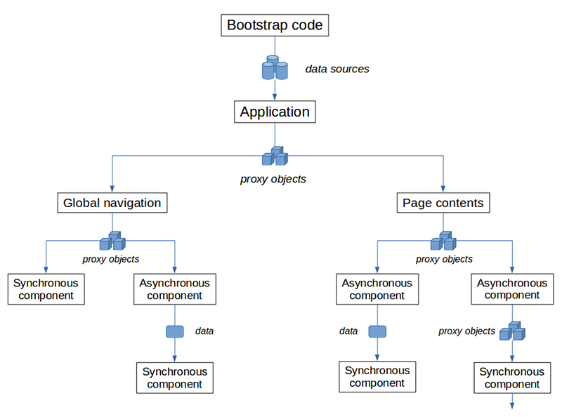

Relaks
======

Relaks is a light-weight library that enables the use of asynchronous functions in [React](https://reactjs.org/) components. It lets you perform data retrieval as a part of the rendering sequence. This greatly simplifying your front-end logics.

## Basic usage

The following code comes from [one of the examples](https://github.com/trambarhq/relaks-starwars-example-sequel). The component display information about one of the Star Wars films. It uses data from [swapi.co](https://swapi.co/).

```javascript
import React, { Component } from 'react';
import Relaks, { useProgress } from 'relaks';

import { List } from 'widgets/list';
import { Loading } from 'widgets/loading';

async function FilmPage(props) {
    const { route, swapi } = props;
    const [ show ] = useProgress();

    render();
    const film = await swapi.fetchOne(`/films/${route.params.id}/`);
    render();
    const characters = await swapi.fetchMultiple(film.characters);
    render();
    const species = await swapi.fetchMultiple(film.species);
    render();
    const planets = await swapi.fetchMultiple(film.planets);
    render();
    const vehicles = await swapi.fetchMultiple(film.vehicles);
    render();
    const starships = await swapi.fetchMultiple(film.starships);
    render();

    function render() {
        if (!film) {
            show(<Loading />);
        } else {
            show(
                <div>
                    <h1>{film.title}</h1>
                    <p>{film.opening_crawl}</p>
                    <div>Director: {film.director}</div>
                    <div>Producer: {film.producer}</div>
                    <div>Release date: {film.release_date}</div>
                    <h2>Characters</h2>
                    <List urls={film.characters} items={characters} pageName="character-summary" route={route} />
                    <h2>Species</h2>
                    <List urls={film.species} items={species} pageName="species-summary" route={route} />
                    <h2>Planets</h2>
                    <List urls={film.planets} items={planets} pageName="planet-summary" route={route} />
                    <h2>Vehicles</h2>
                    <List urls={film.vehicles} items={vehicles} pageName="vehicle-summary" route={route} />
                    <h2>Starships</h2>
                    <List urls={film.starships} items={starships} pageName="starship-summary" route={route} />
                </div>
            );
        }
    }
}

const component = Relaks.memo(FilmPage);

export {
    component as FilmPage,
};
```

A Relaks component is an asynchronous function that uses the `useProgress` hook. The hook provides `show()`, a function for updating the component. In the code above, the task of rendering the page contents is delegated to the inner function `render()`. It makes use of variable declared outside it. Initially, they're all undefined. The function therefore renders a loading animation. `FilmPage()` then requests the film object and wait for it to arrive. When it does, `render()` is called again to display the information about the film. Then the character objects are fetched and `render()` is called yet again. And so on, until everything become available.

At the bottom, we call `Relaks.memo()` to create something that looks like a normal functional component to React and export it.  

You can see the code in action [here](https://trambar.io/examples/starwars-v/#/films/1/).

## Progressive rendering delay

Progressive rendering makes a component feels more responsive. It doesn't start immediately by default. A component has a small window of time to retrieve everything it needs and fully render itself. Only if it fails to do so would progressive rendering commerce. If all `await` operations took minimal amount of time (because all data is cached), then only the contents passed to the last call to `show()` would be rendered.

The default delay is 50ms during the initial rendering cycle and infinity in subsequent cycles. Basically, progressive rendering is turned off once a component manages to fully render itself. You can supply different delay intervals to `useProgress()`.

For a very brief moment a Relaks component will be blank. If this causes layout or visual glitches, you can force Relaks to render the progress element initially by passing `'initial'` as the second parameter to `show()`.

## Interruption of rendering

When a Relaks component receives new props (or experiences a state change), its render function is called and a new rendering cycle starts. If the component was still in the middle of rendering--i.e. the promise returned earlier had not yet been fulfilled--this earlier rendering cycle would be canceled. An asynchronous rendering cycle could also get canceled when the component is unmounted.

A call to `show()` in the defunct rendering cycle would trigger an `AsyncRenderingInterrupted` exception, causing the function to bail out. In the example above, if the component gets unmounted while it's fetching the film object, the second call to `render()` will throw. We won't end up wasting bandwidth fetching related data we no longer need. Relaks will silently swallow the exception.

## Error handling

When an error is not explicitly handled in a component's render function, Relaks will catch the error, force the component to refresh, then promptly throw the error object again. Doing so permits React's [error boundary](https://reactjs.org/docs/error-boundaries.html) mechanism to capture the error as it would catch errors occurring in synchronous code.

In the example above, if one of the requested objects does not exist, `swapi.fetchXXX()` would throw asynchronously (i.e. rejection of the promise it has returned). If a component further up the tree has set an error boundary, the error would be caught there.

## Additional rules of hooks

In addition to React's [rules of hooks](https://reactjs.org/docs/hooks-rules.html#only-call-hooks-from-react-functions), Relaks imposes two rules:

* `show()` from `useProgress` must be called once before the first use of `await`.
* All hooks must be called prior to the call to `show()`.

These rules ensure that hooks will be called in the proper order.

## Asynchronous loop

Relaks makes it easy to deal with long running operations. It lets you wait for something to occur in a loop. Suppose you're building a front-end of a cloud hosting application. After the addition of a new virtual machine, the user is sent to its summary page. Creation of the VM takes time, during which we want display its progress. We could write something like the following:

```javascript
    let vm, vmCreation;
    while (!vm) {
        const response = await fetch(vmInfoURL);
        if (response.status === 200) {
            vm = await response.json();
            render();
        } else if (response.status === 202) {
            vmCreation = await response.json();
            render();
            await delay(1000);
        } else {
            throw new Error(`Unexpect HTTP status code ${response.status}`);
        }
    }
```

When the VM is ready, we receive the status code 200 and information about the VM. When it's still being created, we receive 202 and information about the creation process, after which we pause for a second and try again.

See the [media capture example](https://github.com/trambarhq/relaks-media-capture-example) for a demonstration of how loops can simplify coding.

## Isomorphic front-end

Relaks is designed from the ground up to support server-side rendering (SSR). SSR is natural and intuitive as asynchronous components have a definite end state. A component is "ready" when the asynchronous function ends--i.e. the promise it returned is fulfilled.

In the [Star Wars example above](#basic-usage), `FilmPage` is not yet ready when all it has is the film object. It's not ready when it has the character list. It's ready when it has fetched all information related to the film. This occurs with the last call to `render()`. The contents given to this final call is what we want.

Please consult the [final Star Wars example](https://github.com/trambarhq/relaks-starwars-example-isomorphic) if you're interested in the technique. The [WordPress example](https://github.com/trambarhq/relaks-wordpress-example) provides a more sophisticated demonstration of what's achievable in a real-world situation.

## Saving data

Relaks provides the utility hook `useSaveBuffer` to facilitate data entry. It returns an object that holds locally made changes prior to their transfer to the remote server:

From the [Django todo list example](https://github.com/trambarhq/relaks-django-todo-example):

```javascript
    const draft = useSaveBuffer({
        original: _.defaults(todo, { title: '', description: '' }),
        compare: _.isEqual,
        merge: mergeObjects,
        save: async (base, ours) => {
            return django.saveOne('/', ours);
        },
        delete: async (base, ours) => {
            return django.deleteOne('/', base);
        },
        preserve: (base, ours) => {
            preserveObject('todo', ours);
        },
        restore: (base) => {
            return restoreObject('todo', base);
        },
    });
```

Please consult the example for more information on using the hook.

## Building a complete front-end

Relaks is a simple, unopinionated library that can be used in a variety of situations. The following is a suggested model on how to build a complete front-end of a web application.



### Bootstrapping

The bootstrap code kick-starts the web client. It's run right after the HTML page has loaded. It creates data providers, wait for them to become ready, then render the root React component into a DOM node. Here's the bootstrap code from [the Starwars example](https://github.com/trambarhq/relaks-starwars-example-sequel):

```javascript
async function initialize(evt) {
    // create remote data source
    const dataSource = new DjangoDataSource({
        baseURL: 'https://swapi.co/api',
    });
    dataSource.activate();

    // create route manager
    const routeManager = new RouteManager({
        useHashFallback: (process.env.NODE_ENV === 'production'),
        routes,
    });
    routeManager.activate();
    await routeManager.start();

    const container = document.getElementById('react-container');
    const element = createElement(FrontEnd, { dataSource, routeManager });
    render(element, container);
}
```

### Data providers

A data provider is simply an object that provides data needed by the front-end. It can do so synchronously or asynchronously (i.e. through promise-returning methods). It'll typically be an event emitter. When a provider wishes to indicate that new data is available, it emits a `change` event.

An example of a synchronous data provider is [relaks-route-manager](https://github.com/trambarhq/relaks-route-manager). It extracts parameters from the browser's location. When the user clicks on a hyperlink or the back button, the current route changes. The route manager emits a `change` event and the front-end rerenders using new parameters extracted from the URL.

An example of an asynchronous data provider is [relaks-django-data-source](https://github.com/trambarhq/relaks-django-data-source). It retrieves data from a Django backend. It provides a set of `fetchXXX()` methods that return promises. When given an expiration interval, the data source will periodically invalidate cached results and emit a `change` event.

Data providers need not be coded specifically for Relaks. They're just classes that return data. They can be reused in other contexts (on the server side, for instance). The only requirement imposed by Relaks is the need for caching. Asynchronous methods should always return the same promise when give the same arguments unless the underlying data has changed. Otherwise a lot of redundant operations would occur whenever the front-end rerenders.

### Root-level component

`FrontEnd` is the root-level React component. It receives a set of data providers as props. It creates proxy objects around these data providers and pass them down the component tree in in lieu of the providers themselves.

From [our Starwars example](https://github.com/trambarhq/relaks-starwars-example-sequel):

```javascript
import React, { useEffect, useMemo } from 'react';
import { useEventTime } from 'relaks';
import { SWAPI } from 'swapi';
import { Route } from 'routing';
import { NavBar } from 'widgets/nav-bar';
import 'style.scss';

function FrontEnd(props) {
    const { routeManager, dataSource } = props;
    const [ routeChanged, setRouteChanged ] = useEventTime();
    const [ dataChanged, setDataChanged ] = useEventTime();
    const route = useMemo(() => {
        return new Route(routeManager);
    }, [ routeManager, routeChanged ]);
    const swapi = useMemo(() => {
        return new SWAPI(dataSource);
    }, [ dataSource, swapiChanged ]);

    useEffect(() => {
        routeManager.addEventListener('change', setRouteChanged);
        dataSource.addEventListener('change', dataChanged);

        return () => {
            routeManager.removeEventListener('change', setRouteChanged);
            dataSource.removeEventListener('change', setDataChanged);
        };
    }, [ routeManager, dataSource ]);

    const PageComponent = route.params.module.default;
    return (
        <div>
            <NavBar route={route} />
            <div className="contents">
                <PageComponent route={route} swapi={swapi} />
            </div>
        </div>
    );
}

export {
    FrontEnd
};
```

The `useEventTime` hook works like `useState`, but its setter function sets the variable to the current time (instead of the value given). Using the setter as an event handler means the date is changed everytime the event occurs. That in turns forces `useMemo` to recalculate its result (since the date is listed as a dependency). The use of `useEventTime` here allows us to respond to both prop changes and events using the same code.

`useDemo` is used to recreate a proxy object whenever the associated data provider indicates new data is available.

### Proxy objects

Proxy objects serve a number of purposes. First and foremost, they're used to trigger rerendering of [memoized components](https://reactjs.org/docs/react-api.html#reactmemo).  A memoized component is rendered only when a shallow comparison indicates that its props have changed. Recreation of proxy objects when `change` events occur triggers that, ensuring that new data is propagated through the component tree.

Proxy objects also insulate your code from third-party code. You can tailor them to fit your preferred convention and phraseology. For example, [relaks-django-data-source](https://github.com/trambarhq/relaks-django-data-source) provides a `fetchOne()` method that accepts an URL as parameter. Instead of calling this everywhere, you can implement a set of methods specific to your app's database schema. For example:

```javascript
class Database {
    constructor(dataSource) {
        this.dataSource = dataSource;
    }

    async getStoryByID(storyID) {
        return this.dataSource.fetchOne(`/stories/${storyID}`);
    }

    async getCategoryByID(catID) {
        try {
            if (catID) {
                return this.dataSource.fetchOne(`/categories/${catID}`);
            }
        } catch (err) {
            if (err.status === 404 && process.env.NODE_ENV !== 'production') {
                throw err;
            }
        }
        return defaultCategory;
    }

    /* ... */
}
```

The code above shows how you can implement certain pragmatics in a proxy object. For `getCategoryByID()`, we know that `catID` can be 0. In such an event we simply return a default category. We also choose to handle 404 error differently in the production environment. Instead of letting the error bubble up to an error boundary (leading to the unmounting of the component) we'd simply show the default when a category has gone missing.

Proxy objects make debugging easier. You can easily stick `console.log()` and conditional `debugger` statements into your own code. You can find your source file far more quickly than something deep inside `node_modules` (especially if you choose not to generate sourcemaps for libraries).

## Class-based component

Relaks was developed initially for class-based React. Version 2 retains this support. A class-based Relaks component inherits from `AsyncComponent` and implemnts `renderAsync(meanwhile)`. It receives the `show()` function from the argument `meanwhile`:

```javascript
import React from 'react';
import { AsyncComponent } from 'relaks';

class FilePage extends AsyncComponent {
    async renderAsync(meanwhile) {
        const { route, swapi } = this.props;

        render();
        const film = await swapi.fetchOne(`/films/${route.params.id}/`);
        render();
        const characters = await swapi.fetchMultiple(film.characters);
        render();
        const species = await swapi.fetchMultiple(film.species);
        render();
        const planets = await swapi.fetchMultiple(film.planets);
        render();
        const vehicles = await swapi.fetchMultiple(film.vehicles);
        render();
        const starships = await swapi.fetchMultiple(film.starships);
        render();

        function render() {
            if (!film) {
                meanwhile.show(<Loading />);
            } else {
                meanwhile.show(
                    <div>
                        <h1>{film.title}</h1>
                        <p>{film.opening_crawl}</p>
                        <div>Director: {film.director}</div>
                        <div>Producer: {film.producer}</div>
                        <div>Release date: {film.release_date}</div>
                        <h2>Characters</h2>
                        <List urls={film.characters} items={characters} pageName="character-summary" route={route} />
                        <h2>Species</h2>
                        <List urls={film.species} items={species} pageName="species-summary" route={route} />
                        <h2>Planets</h2>
                        <List urls={film.planets} items={planets} pageName="planet-summary" route={route} />
                        <h2>Vehicles</h2>
                        <List urls={film.vehicles} items={vehicles} pageName="vehicle-summary" route={route} />
                        <h2>Starships</h2>
                        <List urls={film.starships} items={starships} pageName="starship-summary" route={route} />
                    </div>
                );
            }
        }
    }
}
```

## Preact support

Relaks has built-in support for [Preact](https://preactjs.com/). Simply import from 'relaks/preact' instead of 'relaks':

```javascript
import { h } from 'preact';
import { AsyncComponent } from 'relaks/preact';

/** @jsx h */
```

`renderAsync()` will receive `props` and `state` in addition to the meanwhile object.

## Libraries & add-ons

* [relaks-route-manager](https://github.com/trambarhq/relaks-route-manager) - route manager
* [relaks-django-data-source](https://github.com/trambarhq/relaks-django-data-source) - retrieves data through Django REST API
* [relaks-wordpress-data-source](https://github.com/trambarhq/relaks-wordpress-data-source) - retrieves data from WordPress
* [relaks-harvest](https://github.com/trambarhq/relaks-harvest) - library used for server-side rendering (SSR)
* [relaks-event-emitter](https://github.com/trambarhq/relaks-event-emitter) - event emitter designed with asynchronous code in mind
* [relaks-media-capture](https://github.com/trambarhq/relaks-media-capture) - capturing video and images in web browser

## Examples

* [Starwars API](https://github.com/trambarhq/relaks-starwars-example) - a simple example that fetches data from [SWAPI.co](SWAPI.co)
* [Starwars API: Episode V](https://github.com/trambarhq/relaks-starwars-example-sequel) - sequel to the first Starwars API example
* [Starwars API: Episode VI - The Server Strikes Back](https://github.com/trambarhq/relaks-starwars-example-isomorphic) - demonstrates how to create an isomorphic front-end
* [Django todo list](https://github.com/trambarhq/relaks-django-todo-example) - demonstrates authentication and data saving using [relaks-django-data-source](https://github.com/trambarhq/relaks-django-data-source)
* [Hacker News reader](https://github.com/trambarhq/relaks-hacker-news-example) - building a quick-and-dirty HN front-end
* [Media capture](https://github.com/trambarhq/relaks-media-capture-example) - demonstrates how to capture video
* [Zero-latency WordPress](https://github.com/trambarhq/relaks-wordpress-example) - building an extremely responsive WordPress front-end
* [Trambar](https://trambar.io) - a real-world social app for which Relaks was created

## Questions

If you have questions concerning Relaks, feel free to contact me by [e-mail](chernyshevsky@hotmail.com). You can also post your question at [Stack Overflow](https://stackoverflow.com/). I'm tracking the "relaks" tag.

You can follow the development of projects related to Relaks at my [Trambar](https://live.trambar.io/).

## License

This project is licensed under the MIT License - see the [LICENSE](#LICENSE) file for details

## Acknowledgement

Relaks is named after a [bar in Krakow, Poland](https://www.google.pl/maps/place/Relaks+craftbeer+%26+food/@50.0626813,19.941311,18.08z/data=!4m5!3m4!1s0x47165b11a033a251:0x16ac7571f9bb26c!8m2!3d50.0622392!4d19.9422542?hl=en).


