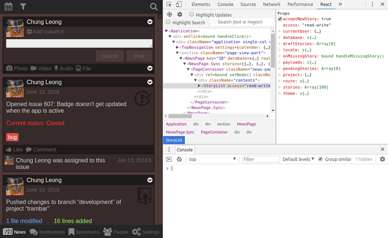

Relaks
------

Relaks is a minimalist library that give [React](https://reactjs.org/)
components a [promise-based](https://promisesaplus.com/), asynchronous interface.
Instead of `render()`, Relaks components implement `renderAsync()`, a method that
returns a promise of a `ReactElement`.

* [Basic example](#basic-example)
* [Example with multiple async operations](#example-with-multiple-async-operations)
* [ES7 syntax](#es7-syntax)
* [Real world example](#real-world-example)
* [Interruption of rendering](#interruption-of-rendering)
* [Progressive rendering delay](#progressive-rendering-delay)
* [Life-cycle functions](#life-cycle-functions)
* [API reference](#api-reference)
* [ES5 convention](#es5-convention)
* [License](#license)
* [Acknowledgement](#acknowledgement)

## Basic example

```javascript
import React from 'react';
import Relaks from 'relaks';

class StoryView extends Relaks.Component {
    renderAsync(meanwhile) {
        var db = this.props.database;
        var query = {
            table: 'story',
            criteria: {
                id: this.props.storyID
            }
        };
        meanwhile.show(<div>Loading</div>);        
        return db.findOne(query).then((story) => {
            return (
                <div>
                    <h1>{story.title}</h1>
                    <p>{story.text}</p>
                </div>
            );
        });
    }
}
```

`renderAsync()` may also return a `ReactElement` or null, in which case it
behaviors like a normal React component.

The parameter `meanwhile` is an object with a number of methods, the chief of
which is `show()`. As the name implies, it lets you show something while an
asynchronous operation--typically data retrieval--is happening. `show()` may be
called multiple times during a single rendering cycle. This allows a component
to render progressively as data arrives.

`Relaks.Component` is also available as `Relaks.AsyncComponent`, so you can
import both it and the standard React `Component`.

## Example with multiple async operations

```javascript
import React from 'react';
import Relaks from 'relaks';

class StoryView extends Relaks.Component {
    renderAsync(meanwhile) {
        var db = this.props.database;
        var query1 = {
            table: 'story',
            criteria: {
                id: this.props.storyID
            }
        };
        meanwhile.show(<div>Loading</div>);        
        return db.findOne(query1).then((story) => {
            meanwhile.show(
                <div>
                    <h1>{story.title}</h1>
                    <h2>Author: -</h2>
                    <h3>Category: -</h3>
                    <p>{story.text}</p>
                </div>
            );

            var query2 = {
                table: 'author',
                criteria: {
                    id: story.author_id
                }
            };
            return db.findOne(query2).then((author) => {
                meanwhile.show(
                    <div>
                        <h1>{story.title}</h1>
                        <h2>Author: {author.name}</h2>
                        <h3>Category: -</h3>
                        <p>{story.text}</p>
                    </div>
                );

                var query3 = {
                    table: 'category',
                    criteria: {
                        id: story.category_id
                    }
                };
                return db.findOne(query3).then((category) => {
                    return (
                        <div>
                            <h1>{story.title}</h1>
                            <h2>Author: {author.name}</h2>
                            <h3>Category: {category.name}</h3>
                            <p>{story.text}</p>
                        </div>
                    );
                });
            });
        });
    }
}
```

In the code above, `renderAsync()` first retrieves the story object. It calls
`meanwhile.show()` to render information that's immediately available. The
author and category names are not yet available. We put dashes in their place
then proceed to retrieve the related objects. Once these are retrieved, actual
text replaces the dashes.

There's a great deal of redundant in the example code. Typically it's advisable
to put the UI code in a separate component:

```javascript
import React from 'react';
import Relaks from 'relaks';

class StoryView extends Relaks.Component {
    renderAsync(meanwhile) {
        var db = this.props.database;
        var props = {
            story: null,
            author: null,
            category: null,
        };
        meanwhile.show(<StoryViewSync {...props} />);        
        return Promise.resolve().then(() => {
            var query1 = {
                table: 'story',
                criteria: {
                    id: this.props.storyID
                }
            };
            return db.findOne(query1).then((story) => {
                props.story = story;
            });
        }).then(() => {
            meanwhile.show(<StoryViewSync {...props} />);        
        }).then(() => {
            var query2 = {
                table: 'author',
                criteria: {
                    id: props.story.author_id
                }
            };
            return db.findOne(query2).then((author) => {
                props.author = author;
            });
        }).then(() => {
            meanwhile.show(<StoryViewSync {...props} />);        
        }).then(() => {
            var query3 = {
                table: 'category',
                criteria: {
                    id: props.story.category_id
                }
            };
            return db.findOne(query3).then((category) => {
                props.category = category;
            });
        }).then(() => {
            return <StoryViewSync {...props} />;
        });
    }
}

class StoryViewSync extends React.PureComponent {
    render() {
        var { story, author, category } = this.props;
        if (!story) {
            return <div>Loading</div>;
        }
        return (
            <div>
                <h1>{story.title}</h1>
                <h2>Author: {author ? author.name : '-'}</h2>
                <h3>Category: {category ? category.name : '-'}</h3>
                <p>{story.text}</p>
            </div>
        );
    }
}
```

## ES7 syntax

The example above becomes a lot cleaner when we use the ES7 await operator:

```javascript
import React from 'react';
import Relaks from 'relaks';

class StoryView extends Relaks.Component {
    async renderAsync(meanwhile) {
        var db = this.props.database;
        var props = {
            story: null,
            author: null,
            category: null,
        };
        meanwhile.show(<StoryViewSync {...props} />);        
        props.story = await db.findOne({
            table: 'story',
            criteria: {
                id: this.props.storyID
            }
        });
        meanwhile.show(<StoryViewSync {...props} />);        
        props.author = await db.findOne({
            table: 'author',
            criteria: {
                id: props.story.author_id
            }
        });
        meanwhile.show(<StoryViewSync {...props} />);
        props.category = await db.findOne({
            table: 'category',
            criteria: {
                id: props.story.category_id
            }
        });
        return <StoryViewSync {...props} />;
    }
}
```

## Real World Example

Relaks was created in support of [Trambar](https://github.com/chung-leong/trambar),
an open-source social-network tool for GitLab. You can see it in action
[here](https://live.trambar.io/). Using the React developer extension, you can
easily see how the application is structured. When you see a component
containing another component whose name ends with ".Sync", it's a Relaks component.



## Interruption of rendering

When a Relaks component receives new props (or experiences a state change), its
renderAsync() is called to start a new rendering cycle. If the component is
still in the middle of rendering--i.e. the promise returned earlier had not yet
been fulfilled--this rendering cycle would be cancelled. If `meanwhile.onCancel`
is set, the function would be invoked at this point.

A call to `meanwhile.show` in the defunct cycle would trigger an
`AsyncRenderingInterrupted` exception, breaking the promise chain. In the
example above, if the component receives a new story ID while it's fetching the
story, the call to `meanwhile.show()` after the story is retrieved will throw.
We won't end up wasting bandwidth fetching the author and category. Relaks will
silently swallow the exception.  

## Progressive rendering delay

By default, progressive rendering will not start immediately. The promise
returned by `renderAsync()` is given a small window of time. Only if it fails
to be fulfilled within this window would progressive rendering occur. If it is
fulfilled quickly (because everything in the promise chain is cached), then
the calls to `meanwhile.show()` would produce no effect.

The default delay is 50ms during the initial rendering cycle and infinity in
subsequent cycles. Basically, progressive rendering is turned off once a
component manages to fully render itself. You can alter the delay intervals
with a call to `meanwhile.delay()`.

For a very brief moment a Relaks component will be blank. If this causes layout
or visual glitches, you can force Relaks to render the progress element
initially by passing `'initial'` as the second parameter to `meanwhile.show()`.

## Life-cycle functions

`Relaks.Component` implements `componentWillMount()` and `componentWillUnmount()`
in order to monitor whether a component is still mounted. If you override
them be sure to call the parent implementations.

`Relaks.Component` also implements `shouldComponentUpdate()`. Shallow
comparisons are done on a component's props and state to determine whether it
needs to be rerendered. Override the method if you need more sophisticated
behavior.

## API reference

* [Methods](#methods)
  * [meanwhile.check](#meanwhilecheck)
  * [meanwhile.delay](#meanwhiledelay)
  * [meanwhile.revising](#meanwhilerevising)
  * [meanwhile.show](#meanwhileshow)
* [Event handlers](#event-handlers)
  * [meanwhile.onCancel](#meanwhileoncancel)
  * [meanwhile.onComplete](#meanwhileoncomplete)
  * [meanwhile.onProgress](#meanwhileonprogress)
* [Properties](#properties)
  * [meanwhile.current](#meanwhilecurrent)
  * [meanwhile.previous](#meanwhileprevious)
  * [meanwhile.prior](#meanwhileprior)

### Methods

#### meanwhile.check

```typescript
function check()
```

Check if the rendering cycle has been superceded by a new one. If so throw an
exception to end it. Ensure component is mounted as well. Generally you would
use `meanwhile.show()` instead.

#### meanwhile.delay

```typescript
function delay(empty: number, rendered: number)
```

Set progressive rendering delay, for when the component is empty and when
it has fully rendered previously. When a parameter is `undefined`, it's ignored.

#### meanwhile.revising

```typescript
function revising(): boolean
```

Return true if the component has previously been fully rendered.

#### meanwhile.show

```typescript
function show(element: ReactElement, disposition: string): boolean
```

Render an element while awaiting the completion of asynchronous operations,
possibly after a delay. Use `disposition` to force immediate rendering. When
it's `'always'`, the element is always rendered. When it's `'initial'`, the
element is rendered if the component would otherwise be empty.

A return value of `false` means rendering is being deferred.

This method calls `meanwhile.check()` to ascertain that the rendering cycle is
still valid.

### Event handlers

Relaks will call event handlers attached to the meanwhile object at certain
points during the rendering cycle. They're useful for debugging and
optimization.

#### meanwhile.onCancel

Triggered when a rendering cycle is canceled.

#### meanwhile.onComplete

Triggered when a render cycle is coming to an end, after the promise returned by
`renderAsync` is fulfilled, but prior to the contents is rendered.

#### meanwhile.onProgress

Triggered when a contents passed to `meanwhile.show()` is about to be rendered.
The event object will have an `elapsed` property, giving the number of
milliseconds elapsed since the start of the rendering cycle.

### Properties

The following properties are provided mainly for debugging purpose.

#### meanwhile.current

An object containing component's current props and state.

#### meanwhile.previous

An object containing component's previous props and state.

#### meanwhile.prior

An object containing component's props and state prior to rerendering. It will
be the same as `meanwhile.previous` unless the previous rendering cycle was
interrupted, in which case `previous` would have the props and state of the
interrupted cycle, while `prior` would have those of the last completed cycle.

## ES5 convention

Relaks supports the older method of creating a component:

```javascript
module.exports = Relaks.createClass({
    displayName: 'StoryView',

    renderAsync: function(meanwhile) {
        /* ... */
    },
});
```

## License

This project is licensed under the MIT License - see the [LICENSE](#LICENSE)
file for details

## Acknowledgement

Relaks is named after a [bar in Krakow, Poland](https://www.google.pl/maps/place/Relaks+craftbeer+%26+food/@50.0626813,19.941311,18.08z/data=!4m5!3m4!1s0x47165b11a033a251:0x16ac7571f9bb26c!8m2!3d50.0622392!4d19.9422542?hl=en).


